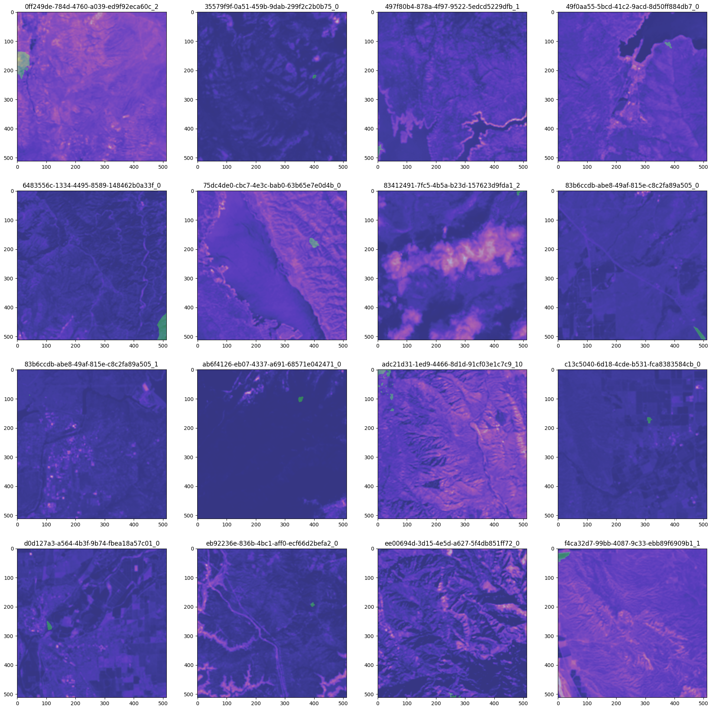
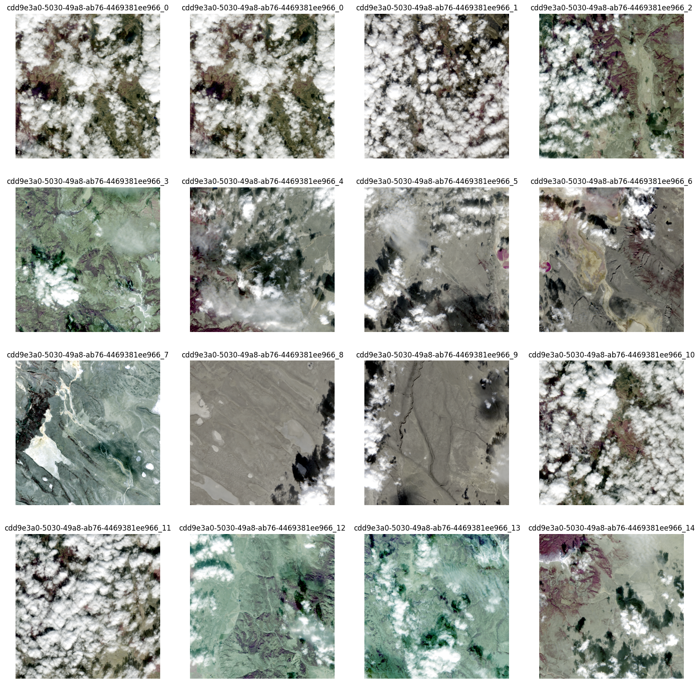
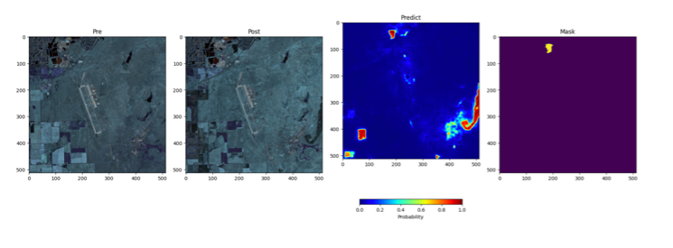
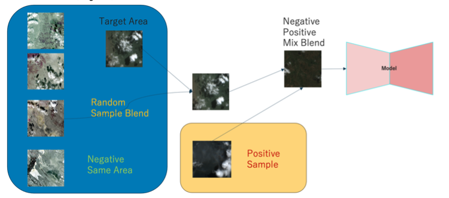

# competitions/ChaBuD-ECML-PKDD2023
Competition: https://huggingface.co/spaces/competitions/ChaBuD-ECML-PKDD2023



## Dataset
https://huggingface.co/datasets/chabud-team/chabud-ecml-pkdd2023

```
@article{ title={CaBuAr: California Burned Areas dataset for delineation}, author={Rege Cambrin, Daniele; Colomba, Luca; Garza, Paolo}, journal={IEEE Geoscience and Remote Sensing Magazine}, doi={10.1109/MGRS.2023.3292467}, year={2023} }
```

### Sample


### Predict


### Modeling Method



# Environment

## Anaconda
```bash
conda create -n wildfire  python=3.8
conda activate wildfire
pip install -r env/requirements.txt

# CUDA version
## 3090 Ampare CUDA: 11.2
pip install torch==1.8.0+cu111 torchvision==0.9.0+cu111 torchaudio==0.8.0 -f https://download.pytorch.org/whl/torch_stable.html
## or your CUDA Driver version
```

## Contributors
- https://github.com/syu-tan
- https://github.com/hiroshiyokoya

## Report
- [chabud_wildfire_report.pdf](./report/chabud_wildfire_report.pdf)
